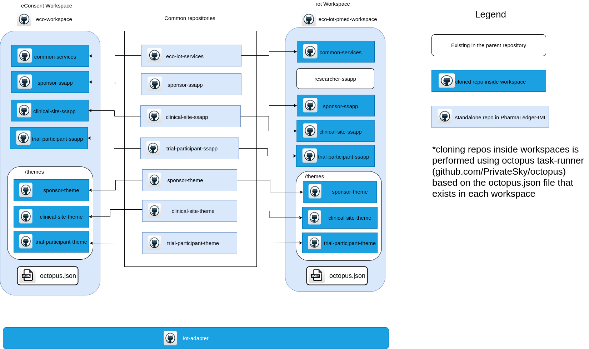

# iot-pmed-workspace

*iot-pmed-workspace*  bundles all the necessary dependencies for building and running SSApps in a single package.

For more details about what a *workspace* is check out the [template-workspace](https://github.com/PrivateSky/template-workspace).

## General architecture



## Installation

In order to use the workspace, we need to follow a list of steps presented below. 

If you have trouble installing the *iot-pmed-workspace*, please try to follow the guide provided on [PrivateSky.xyz](https://privatesky.xyz/?Start/installation)

### Step 1: Clone the workspace

```sh
$ git clone https://github.com/PharmaLedger-IMI/iot-pmed-workspace.git
```

After the repository was cloned, you must install all the dependencies.

```sh
$ cd iot-pmed-workspace
#Important: for the development mode we proceed with npm run dev-install
#For normal installation, the command is: npm install
$ npm run dev-install 
```

**Note:** this command might take quite some time depending on your internet connection and you machine processing power.

### Step 2: Launch the api-hub

While in the *iot-pmed-workspace* folder run:

```sh
$ npm run apihub
```

At the end of this command you get something similar to:


### Step 3: Launch the iot-adaptor

While in the *iot-pmed-workspace* folder run:

```sh
$ npm run iot-adaptor
```

NOTE: On Linux deployment based systems you can run directly ```npm run server``` instead of steps 2 and 3.    

### Step 4: Build all things needed for the application to run.

Open a new console inside *iot-workspace* folder and run:

```sh
# Note: Run this in a new console inside "iot-workspace" folder
$ npm run build-all
```

To build individual applications open a new console inside *iot-pmed-workspace* folder and run one of the following commands:

```bash
# Run this to build trial-participant-sapp
$ npm run build-tp
```

```bash
# Run this to build clinical-site-sapp
$ npm run build-cs
```

```bash
# Run this to build researcher-sapp
$ npm run build-rs
```

Also, refer [package.json](package.json) file for more commands.

## Running

To run the application launch your browser (preferably Chrome ) in private or incognito mode depending on your browser and access the http://localhost:8080 link.

## Prepare and release a new stable version of the workspace

Steps:

1. start from a fresh install of the workspace.

```
git clone https://github.com/PharmaLedger-IMI/iot-pmed-workspace
cd iot-pmed-workspace
```

2. run the installation process of the workspace

```
npm install
```

3. run the server and build the ssapps and wallets

```
npm run server
npm run build-all
```

4. verify that the builds are successfully and the ssapps are functioning properly
5. execute the freeze command

```
npm run freeze
```

6. verify the output of freeze command and check for errors. If any, correct them and run again the freeze command.
7. commit the new version of the `octopus.json` file obtained with the freeze command.
